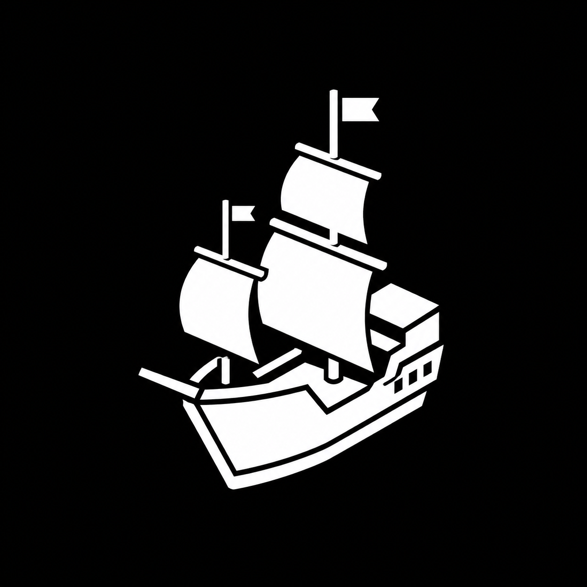

<p align="center">
  
</p>

<p align="center">
  <a href="https://github.com/Hydr46605/Sail">
    
  </a>
  <a href="https://papermc.io/software/velocity">
    
  </a>
  <a href="https://papermc.io">
    
  </a>
</p>

# Sail

Sail is a Minecraft identity layer for offline-mode networks. It gives players
a browser-based Sail session instead of a chat password, while keeping
Mojang/Microsoft ownership as the authority for premium names.

The gateway sits in front of the Paper backend, verifies signed Sail sessions,
and decides whether a player can use a name on that server. Paper receives
verified identity metadata for diagnostics and integrations; it does not perform
the Sail login.

What Sail provides:

- browser/OAuth account access for local identities,
- no `/register` or `/login` password flow,
- premium-name protection before local claims are accepted,
- signed registry sessions verified by Velocity,
- self-hosted registry support where the server owner opts in,
- an optional Paper companion for admin visibility and backend metadata.

This repository now contains the working alpha monorepo: protocol contracts,
the Sail Registry service, the Velocity gateway, the Paper diagnostics
companion, the local Console alpha, PostgreSQL migrations, local ops tooling,
and smoke-test infrastructure.

## Repository Shape

Sail is designed as a monorepo with clean product-oriented boundaries:

```text
platform/registry   Sail Registry service
platform/console    Sail web console
minecraft/gateway   Velocity gateway integration
minecraft/companion Paper/Bukkit companion integration
protocol/           Versioned contracts, schemas, claims, config, fixtures
ops/                Local/deploy operational assets
tools/              Development and verification scripts
```

The component boundaries and login path are documented in
[Architecture](docs/architecture.md).

The current implementation state and alpha boundaries are tracked in
[Current State](docs/current-state.md).

## Stack

Sail uses TypeScript for the web platform, Java 21 for Minecraft integrations,
PostgreSQL for identity state, and OpenAPI/JSON Schema/JWS contracts between
runtimes.

Local setup and verification commands are documented in
[Local Development](docs/local-development.md).

## Alpha Release

Sail Generic builds the alpha product bundle. Deployment repositories can use
that bundle for public landing pages, infrastructure, and downloads.

```sh
pnpm release:alpha
```

The release bundle shape is documented in
[Local Development](docs/local-development.md).

## Local Verification

CI is intentionally test-only. It verifies Sail Generic checks, tests, Gradle,
and PostgreSQL registry behavior, but it does not deploy Sail Global or publish
production artifacts.

Ignored local runtime artifacts and cleanup commands are documented in
[Local Development](docs/local-development.md).

Low-cost verification without PostgreSQL:

```sh
just db-down
pnpm check
pnpm test
./gradlew test
```

Durable registry verification with local PostgreSQL:

```sh
just db-up
pnpm test:db
pnpm test
just db-down
```

API-only local smoke:

```sh
just db-up
node ops/local/smoke-local.mjs --skip-servers
just db-down
```

Full Velocity/Paper local smoke uses pinned ES256 Sail session verification and
downloads/runs local Minecraft server artifacts. The skip-server smoke still
builds and inspects both Minecraft plugin jars; the full smoke also installs the
Paper companion into the backend. Run full smoke only when that runtime cost is
intentional:

```sh
node ops/local/smoke-local.mjs
```

## Key Custody

Registry signing-key custody, rotation, revocation, and recovery are documented
in [Security](docs/security.md).
Production or Sail Global deployments must use an explicit `env` or `file`
signing-key source; the built-in dev key is local-only.

## Paper Companion

The Paper companion is a diagnostics and backend-visibility plugin, not a second
authentication layer. Velocity remains the enforcement point. The gateway
forwards a `sail.identity.v1` profile property after a Sail local session is
verified; the companion validates that metadata, tracks online state in memory,
and exposes `/sailpaper status`, `/sailpaper lookup <player>`, `/sailpaper
reload`, and alias `/sailcompanion`.

## Documents

- [Architecture](docs/architecture.md)
- [Identity](docs/identity.md)
- [Configuration](docs/configuration.md)
- [Security](docs/security.md)
- [Local Development](docs/local-development.md)
- [Current State](docs/current-state.md)
